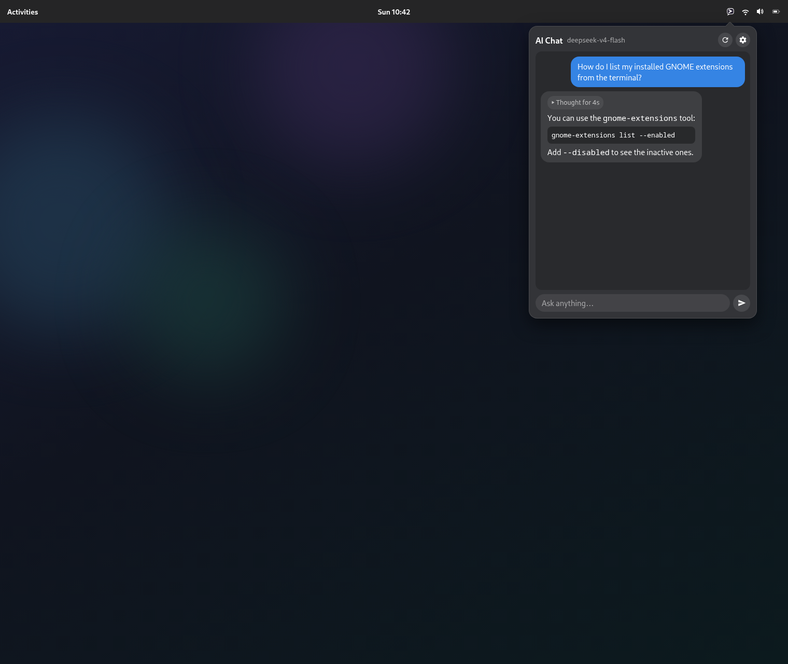
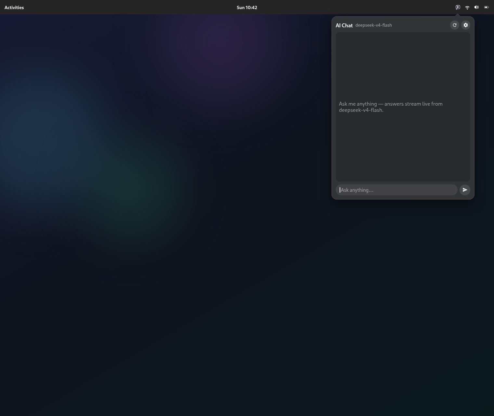

<p align="center">
  
</p>

# AI Tray Chat

A streaming AI chatbot that lives in your GNOME top bar. Click the tray icon (or press
<kbd>Super</kbd>+<kbd>Alt</kbd>+<kbd>C</kbd>) and a chat popup drops down — powered by any
OpenAI-compatible chat completions API.

Works with GNOME Shell **49** and **50** (X11 and Wayland).

<p align="center">
  
  
</p>

## Features

- **Streaming responses** — tokens arrive live over server-sent events, no waiting for the full reply
- **Reasoning support** — models that emit reasoning (e.g. DeepSeek) show a collapsible "Thought process" block
- **Code block rendering** — code fences render as monospace blocks you can select and copy
- **Conversation memory** — configurable number of turns kept as context
- **Any provider** — point it at OpenAI, DeepSeek, Moonshot, a local llama.cpp/LM Studio/Ollama server, or anything else that speaks the OpenAI chat completions format
- **Keyboard-first** — global hotkey to toggle the popup, type and press <kbd>Enter</kbd>
- **Stop & new chat** — cut off a response mid-stream or reset the conversation

## Install

Requires `bash`, `glib-compile-schemas` (part of `glib2`), and GNOME Shell 49+.

```bash
git clone https://github.com/mahdmahd/ChatbotTray.git
cd ChatbotTray
./install.sh
```

The script compiles the settings schema, copies the extension to
`~/.local/share/gnome-shell/extensions/ai-tray-chat@mahdmahd/`, and enables it.

> **First install on Wayland:** GNOME Shell only scans new extensions at startup. Log out and
> back in, then run:
>
> ```bash
> gnome-extensions enable ai-tray-chat@mahdmahd
> ```

You can also install manually without the script:

```bash
mkdir -p ~/.local/share/gnome-shell/extensions/ai-tray-chat@mahdmahd
cp -r metadata.json *.js schemas icons ~/.local/share/gnome-shell/extensions/ai-tray-chat@mahdmahd/
glib-compile-schemas ~/.local/share/gnome-shell/extensions/ai-tray-chat@mahdmahd/schemas
```

## Configure

Open the popup from the top bar and click the **gear icon** (or run
`gnome-extensions prefs ai-tray-chat@mahdmahd`). Under **Connection** set:

| Setting | What it is | Example |
|---|---|---|
| API endpoint | Base URL of an OpenAI-compatible chat completions API | `https://api.openai.com/v1` |
| API key | Your key, stored in GNOME's settings database | `sk-…` |
| Model | The model to chat with | `gpt-4o-mini` |

The endpoint should be the **base URL** — the extension appends `/chat/completions` itself.

<details>
<summary>Local model servers</summary>

No API key or cloud needed — just point the endpoint at a local server:

- **Ollama:** `http://localhost:11434/v1`
- **LM Studio:** `http://localhost:1234/v1`
- **llama.cpp server:** `http://localhost:8080/v1`

</details>

Under **Behavior** you can tune the system prompt, temperature, max tokens, and how many
conversation turns are sent as context. Under **Shortcut** you can turn the hotkey off.

### Keyboard shortcut

The default shortcut is <kbd>Super</kbd>+<kbd>Alt</kbd>+<kbd>C</kbd>. To change the key
combination, use **GNOME Settings → Keyboard → View and Customize Shortcuts** (the switch in
the extension preferences only enables/disables it).

### Install with a pre-configured key

If you don't want to paste the API key into the preferences window, export it before
installing and the script will store it for you:

```bash
ARK_API_KEY="sk-…" ./install.sh
```

## Usage

1. Click the **chat-bubble icon** in the top bar (or press the hotkey).
2. Type in the entry field and press <kbd>Enter</kbd>.
3. The reply streams in below your message; reasoning models also stream a collapsible
   thought process first.
4. The **send button becomes a stop button** while a response is streaming — click it to
   cancel.
5. The **refresh icon** in the header starts a new chat; the **gear icon** opens preferences.

## Troubleshooting

- **Icon doesn't appear after installing** — log out and back in (Wayland), then
  `gnome-extensions enable ai-tray-chat@mahdmahd`.
- **"Authentication failed (HTTP 401/403)"** — the API key is wrong or missing; set it in
  Preferences.
- **"Not found (HTTP 404)"** — check the endpoint and model name; remember the base URL
  should not include `/chat/completions`.
- **"Rate limited (HTTP 429)"** — your provider quota is exhausted or you're sending too fast.
- **Other API errors** — the popup shows the provider's own error message; check the endpoint
  URL and account.
- **Streaming doesn't work / responses arrive all at once** — some proxies buffer server-sent
  events; try a direct connection to the provider.

## Uninstall

```bash
gnome-extensions disable ai-tray-chat@mahdmahd
rm -rf ~/.local/share/gnome-shell/extensions/ai-tray-chat@mahdmahd
```

Optionally reset saved settings:

```bash
dconf reset -f /org/gnome/shell/extensions/ai-tray-chat/
```

## License

MIT — see [LICENSE](LICENSE). Copyright (c) 2026 MehdiKh.

## Credits

Design and code inspired by [2nv2u/gnome-shell-extension-ai-assistant](https://github.com/2nv2u/gnome-shell-extension-ai-assistant).
